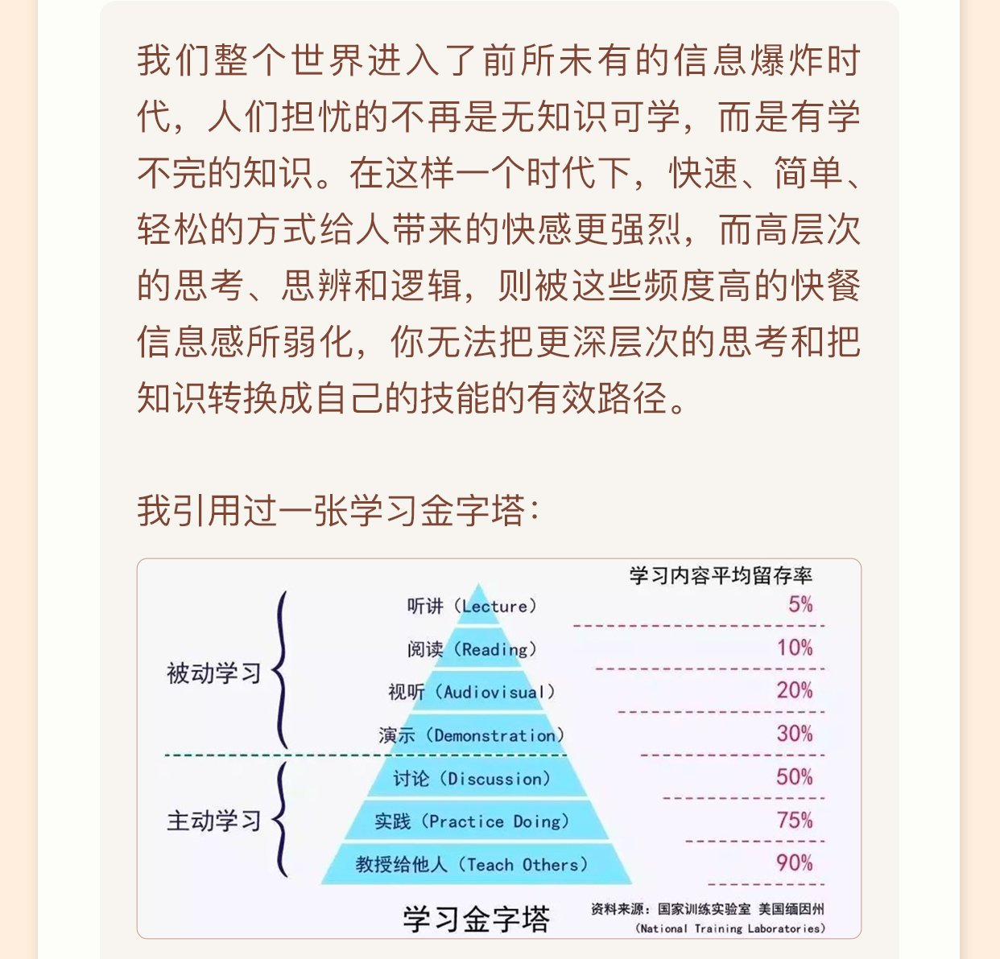
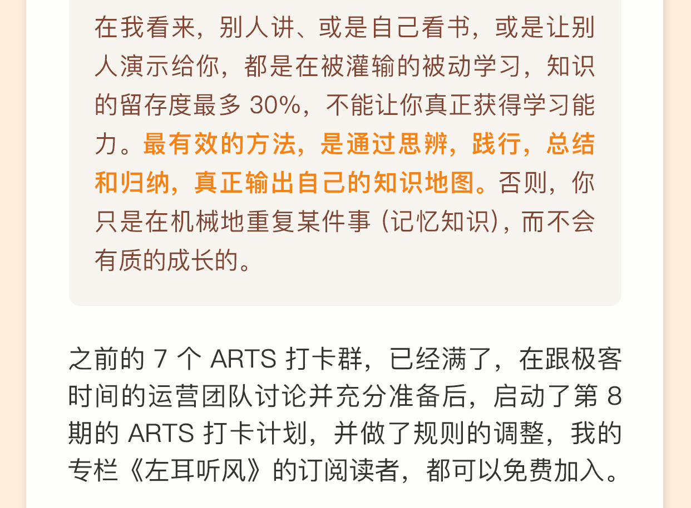

## ARTS

2021年05月30日 14: 17: 05 星期日。

> 陈浩--左耳朵耗子：

#### Algorithm

每周至少做一个 LeetCode 的算法题。主要是为了编程训练和学习。

#### Review

阅读并点评至少一篇英文技术文章。主要是为了学习英文，如果你的英文不行，你基本上无缘技术高手。

#### Tip

学习至少一个技术技巧。主要是为了总结和归纳你日常工作中所遇到的知识点。

#### Share

分享一篇有观点和思考的技术文章。主要是为了建立你的影响力，能够输出价值观。

..